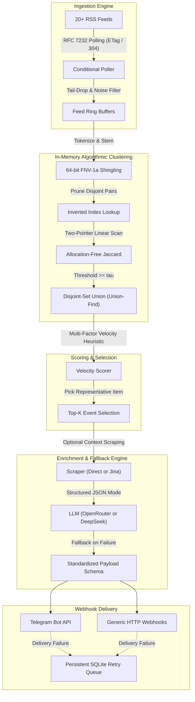

# Celerum

[](https://github.com/rafifmsn/celerum/actions/workflows/ci.yml)
[](https://go.dev/)
[](LICENSE)

A self-hosted, deterministic news intelligence engine written in Go.
Celerum collects high-volume RSS feeds with near-zero bandwidth using RFC 7232 HTTP conditional polling (`304 Not Modified`).
Instead of relying on costly vector embeddings, Celerum uses in-memory token shingling, inverted index pruning, Jaccard similarity, and Disjoint-Set Union (Union-Find) clustering.
Top-scoring breaking event clusters are optionally enriched and summarized via an LLM, then dispatched to Telegram or generic HTTP webhooks.

## Key Features

- **RFC 7232 Conditional Ingestion:**
  Tracks `ETag` and `Last-Modified` headers in an embedded SQLite database.
  Unmodified feeds return `304 Not Modified` with empty bodies, completing in sub-50ms.

- **Algorithmic Clustering (Zero Embedding Costs):**
  Normalizes text, strips stop-words, and hashes 64-bit shingles using FNV-1a.
  Inverted index pruning bypasses over 80 percent of pairwise comparisons.
  Linear two-pointer scans calculate Jaccard similarity with zero heap allocations, merging related coverage via Union-Find.

- **Multi-Source Velocity Scoring:**
  Heuristic scoring prioritizes breaking developments based on cluster density, publisher tiers, and market keywords with time decay penalties.

- **Hybrid Alert Cadence:**
  High-velocity breaking events alert immediately.
  On quiet market cycles, an hourly heartbeat flushes the top-K accumulated stories, guaranteeing consistent signal without duplicate notifications.

- **Resilient AI Pipeline with Automatic Fallback:**
  Supports OpenRouter, DeepSeek, Groq, OpenAI, and Ollama through OpenAI-compatible `/chat/completions`.
  If external AI providers experience outages or rate limits, Celerum automatically falls back to raw RSS descriptions (`enriched: false`).
  Breaking news is never delayed or dropped.

- **Zero-CGO Embedded Storage:**
  Built with `modernc.org/sqlite` for cross-compilation without CGO or GCC toolchains.
  Tracks caching cursors, deduplicates dispatched clusters, and queues webhook retries with automatic daily TTL pruning.

## Architecture Overview



For comprehensive mathematical and protocol documentation, see [docs/architecture.md](docs/architecture.md).

## Quickstart

### 1. Build the Binary

```bash
go build -o celerum ./cmd/celerum
```

### 2. Initialize Configuration

```bash
./celerum init
```

This generates a starter `celerum.yaml` template with overwrite protection.

### 3. Configure Credentials

Copy `.env.example` to `.env` and fill in your keys:

```bash
cp .env.example .env
```

Celerum automatically parses `.env` on startup without requiring manual `export` commands.

### 4. Verify Telegram Connection

```bash
./celerum test telegram
```

### 5. Dry-Run Check (Zero API Spend)

```bash
./celerum check
```

Inspect live feed clustering and heuristic scores on stdout without dispatching webhooks or making LLM calls.

### 6. Run Once or Start Continuous Daemon

Execute a single pass:

```bash
./celerum run --once
```

Start the continuous background worker:

```bash
./celerum run
```

## Production Deployment (Docker)

For continuous 24/7 background operation on a server or VPS, run Celerum as a container managed by Docker Compose.
The service restarts automatically across host reboots or unexpected exits via `restart: unless-stopped`.

### 1. Configure Secrets and Configuration

Ensure `.env` contains your API tokens and `celerum.yaml` contains your feed configuration:

```bash
cp .env.example .env
cp celerum.yaml.example celerum.yaml
```

### 2. Start the Service

```bash
docker compose up -d
```

### 3. Monitor Logs

```bash
docker compose logs -f celerum
```

### 4. Stop the Service

```bash
docker compose down
```

The database and cached cursors are persisted in `./data` on the host across container upgrades.

## Configuration Reference (`celerum.yaml`)

```yaml
version: "1"

database:
  path: "data/celerum.db"

engine:
  poll_interval: "5m"
  window_duration: "3h"
  flush_interval: "1h"
  max_articles_per_feed: 20
  similarity_threshold: 0.40
  breaking_threshold: 12.0
  top_k: 5

feeds:
  - name: "CoinDesk"
    url: "https://www.coindesk.com/arc/outboundfeeds/rss/"
    tier: 1
  - name: "Cointelegraph"
    url: "https://cointelegraph.com/rss"
    tier: 2

keywords:
  boost:
    - "etf"
    - "sec"
    - "fed"
    - "ath"
    - "acquisition"
  blocklist:
    - "/sponsored/"
    - "/press-releases/"

enrichment:
  scraper: "none" # none | direct | jina
  jina_api_key: "${JINA_API_KEY}"

llm:
  enabled: true
  provider: "openrouter" # openrouter | deepseek | openai | groq | ollama
  model: "deepseek/deepseek-chat"
  api_key: "${LLM_API_KEY}"
  language: "id" # target language for summary (e.g. en, id, es, pt-BR)

dispatch:
  telegram:
    enabled: true
    bot_token: "${TELEGRAM_BOT_TOKEN}"
    chat_id: "${TELEGRAM_CHAT_ID}"
  webhook:
    enabled: false
    url: "https://example.com/api/news"
    headers:
      Authorization: "Bearer ${WEBHOOK_SECRET}"
```

## Testing

Run the automated test suite across all packages:

```bash
go test -v ./...
```
