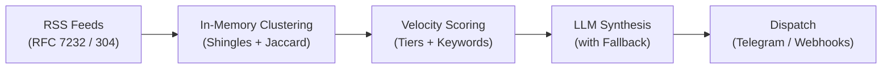

# Celerum

[](https://github.com/rafifmsn/celerum/actions/workflows/ci.yml)
[](https://go.dev/)
[](LICENSE)

A self-hosted, deterministic news intelligence engine written in Go.
Celerum collects high-volume RSS feeds with near-zero bandwidth using RFC 7232 HTTP conditional polling (`304 Not Modified`).
Instead of relying on costly vector embeddings, Celerum uses in-memory token shingling, inverted index pruning, Jaccard similarity, and Disjoint-Set Union (Union-Find) clustering.
Top-scoring breaking event clusters are optionally enriched and summarized via an LLM, then dispatched to Telegram or generic HTTP webhooks.

## Key Features

- **RFC 7232 Conditional Ingestion:**
  Tracks `ETag` and `Last-Modified` headers in an embedded SQLite database.
  Unmodified feeds return `304 Not Modified` with empty bodies, completing in sub-50ms.

- **Algorithmic Clustering (Zero Embedding Costs):**
  Normalizes text, strips stop-words, and hashes 64-bit shingles using FNV-1a.
  Inverted index pruning bypasses over 80 percent of pairwise comparisons.
  Linear two-pointer scans calculate Jaccard similarity with zero heap allocations, merging related coverage via Union-Find.

- **Multi-Source Velocity Scoring:**
  Heuristic scoring prioritizes breaking developments based on cluster density, publisher tiers, and market keywords with time decay penalties.

- **Hybrid Alert Cadence:**
  High-velocity breaking events alert immediately.
  On quiet market cycles, an hourly heartbeat flushes the top-K accumulated stories, guaranteeing consistent signal without duplicate notifications.

- **Resilient AI Pipeline with Automatic Fallback:**
  Supports OpenRouter, DeepSeek, Groq, OpenAI, and Ollama through OpenAI-compatible `/chat/completions`.
  If external AI providers experience outages or rate limits, Celerum automatically falls back to raw RSS descriptions (`enriched: false`).
  Breaking news is never delayed or dropped.

- **Zero-CGO Embedded Storage:**
  Built with `modernc.org/sqlite` for cross-compilation without CGO or GCC toolchains.
  Tracks caching cursors, deduplicates dispatched clusters, and queues webhook retries with automatic daily TTL pruning.

## Architecture Overview



**How it works:**

1. **RFC 7232 Conditional Ingestion (Every 5m + Jitter):**
   Celerum polls all configured RSS and Atom feeds concurrently using cached `ETag` and `Last-Modified` headers stored in SQLite.
   Unchanged feeds respond with `304 Not Modified` and zero body payload, finishing in sub-50ms with zero wasted bandwidth.
   A randomized jitter of up to 10 percent prevents publisher traffic spikes, while per-feed ring buffers (default 20 items) prevent high-frequency publishers from starving slower, high-signal feeds.

2. **In-Memory Token Shingling & Index Pruning:**
   New articles are stripped of HTML tags, normalized to lowercase, and cleared of stop-words.
   Tokens are hashed into 64-bit FNV-1a shingles and stored in sorted slices.
   An in-memory inverted index maps shingle hashes to document IDs, bypassing over 80 percent of pairwise comparisons by immediately skipping document pairs with insufficient shingle overlap.

3. **Allocation-Free Jaccard & Union-Find Clustering:**
   Candidate pairs are evaluated using a linear two-pointer scan across sorted `[]uint64` shingle slices to calculate Jaccard similarity without heap allocations.
   Pairs exceeding the similarity threshold ($\tau \ge 0.40$) are merged via Disjoint-Set Union (Union-Find) with path compression, collapsing multi-source coverage into cohesive event clusters.

4. **Multi-Factor Velocity Scoring:**
   Clusters are scored dynamically based on cluster size $|C_k|$ (multi-source verification), publisher tier weights, and market keyword boosts, balanced against a linear time decay penalty.

5. **Hybrid Alert Cadence:**
   - **Immediate Breaking Alert:** Clusters exceeding the velocity threshold ($S(C_k) \ge \tau_{\text{break}}$) trigger immediate dispatch. A deterministic SHA-256 fingerprint is recorded in SQLite to eliminate duplicate notifications.
   - **Periodic Heartbeat Digest:** Clusters below the threshold remain in the 3-hour sliding window. When the 1-hour flush ticker fires, Celerum dispatches the top-$K$ undispatched clusters as a periodic digest.

6. **Resilient Synthesis & Delivery:**
   Qualified clusters trigger structured JSON completion through OpenAI-compatible LLM endpoints for summaries, key takeaways, and market sentiment.
   If AI providers time out or fail, Celerum automatically falls back to raw RSS descriptions (`enriched: false`), guaranteeing breaking alerts are never lost.
   Failed webhook dispatches are queued in SQLite, where a background worker retries them every 1 minute with exponential backoff up to 5 attempts.

For the comprehensive technical specification and mathematical formulas, see [docs/architecture.md](docs/architecture.md).

## Quickstart

1. **Build the binary:**

   ```bash
   go build -o celerum ./cmd/celerum
   ```

2. **Initialize configuration:**

   ```bash
   ./celerum init
   ```

   This generates a starter `celerum.yaml` template with overwrite protection.

3. **Configure credentials:**

   ```bash
   cp .env.example .env
   ```

   Fill in your tokens in `.env`.
   Celerum automatically loads `.env` on startup without requiring manual `export` commands.

4. **Verify Telegram connection:**

   ```bash
   ./celerum test telegram
   ```

5. **Dry-run check (zero external cost):**

   ```bash
   ./celerum check
   ```

   Inspects live feed clustering and scores on stdout without dispatching webhooks or making LLM calls.

6. **Execute single pass or start continuous daemon:**  
   Run a single cycle (forces an immediate top-$K$ flush and exits with code 0, ideal for cron jobs or CI):
   ```bash
   ./celerum run --once
   ```
   Or start the continuous 24/7 background worker (coordinates the 5-minute poll ticker with jitter, 1-minute retry loop, and 1-hour heartbeat flush):
   ```bash
   ./celerum run
   ```

## Production Deployment (Docker)

For continuous 24/7 background operation on a server or VPS, run Celerum as a container managed by Docker Compose.
The service restarts automatically across host reboots or unexpected exits via `restart: unless-stopped`.

1. **Configure environment and feeds:**

   ```bash
   cp .env.example .env
   cp celerum.yaml.example celerum.yaml
   ```

2. **Start the container stack:**

   ```bash
   docker compose up -d
   ```

3. **Inspect live logs:**

   ```bash
   docker compose logs -f celerum
   ```

4. **Stop the service:**
   ```bash
   docker compose down
   ```

The database and cached cursors are persisted in `./data` on the host across container upgrades.

## Configuration Reference (`celerum.yaml`)

```yaml
version: "1"

database:
  path: "data/celerum.db"

engine:
  poll_interval: "5m"
  window_duration: "3h"
  flush_interval: "1h"
  max_articles_per_feed: 20
  similarity_threshold: 0.40
  breaking_threshold: 12.0
  top_k: 5

feeds:
  - name: "CoinDesk"
    url: "https://www.coindesk.com/arc/outboundfeeds/rss/"
    tier: 1
  - name: "Cointelegraph"
    url: "https://cointelegraph.com/rss"
    tier: 2

keywords:
  boost:
    - "etf"
    - "sec"
    - "fed"
    - "ath"
    - "acquisition"
  blocklist:
    - "/sponsored/"
    - "/press-releases/"

enrichment:
  scraper: "none" # none | direct | jina
  jina_api_key: "${JINA_API_KEY}"

llm:
  enabled: true
  provider: "openrouter" # openrouter | deepseek | openai | groq | ollama
  model: "deepseek/deepseek-chat"
  api_key: "${LLM_API_KEY}"
  language: "id" # target language for summary (e.g. en, id, es, pt-BR)

dispatch:
  telegram:
    enabled: true
    bot_token: "${TELEGRAM_BOT_TOKEN}"
    chat_id: "${TELEGRAM_CHAT_ID}"
  webhook:
    enabled: false
    url: "https://example.com/api/news"
    headers:
      Authorization: "Bearer ${WEBHOOK_SECRET}"
```

## Testing

Run the automated test suite across all packages:

```bash
go test -v ./...
```
