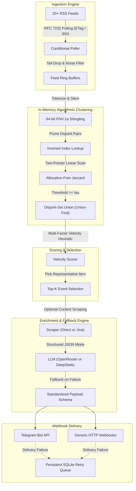
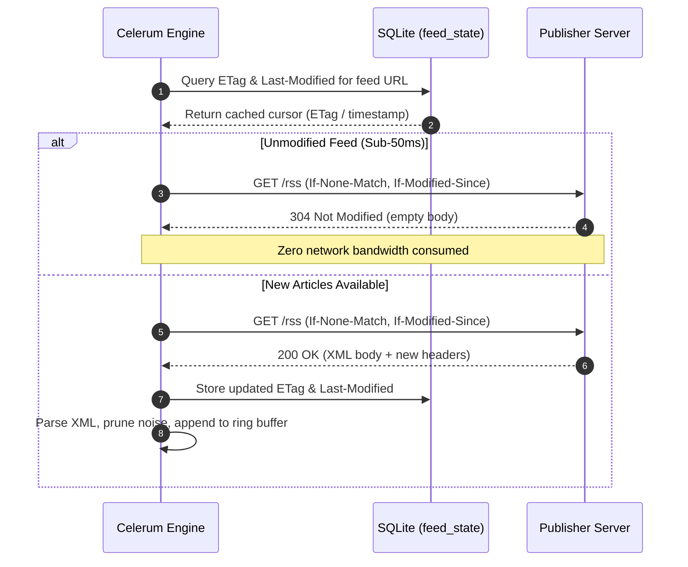
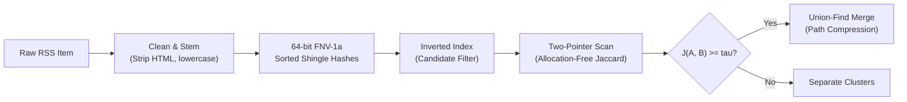
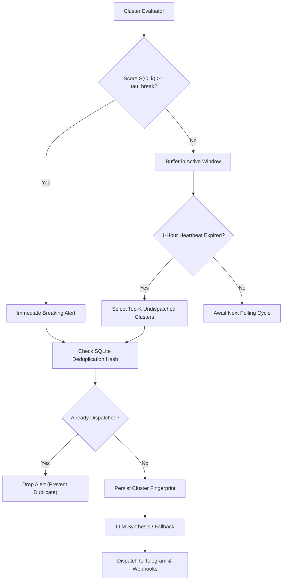

# Celerum Architecture & Technical Specification

## 1. Design Principles

Celerum is designed around algorithmic efficiency, protocol compliance, and deterministic execution.
Instead of relying on vector databases or brute-force LLM ingestion, Celerum uses RFC 7232 HTTP conditional requests, set-theoretic similarity metrics, and Disjoint-Set Union clustering.

## 2. Ingestion Engine: RFC 7232 Conditional Polling

Polling dozens of RSS feeds on frequent intervals risks excessive CPU and network overhead.
Celerum enforces HTTP conditional caching standards:

- **ETag and Last-Modified Tracking:**
  Feed states are stored in an embedded SQLite table (`feed_state`).
  Requests include `If-None-Match` and `If-Modified-Since` headers.
  Unmodified feeds return `304 Not Modified` with empty response bodies, completing in sub-50ms with zero payload overhead.

- **Feed Starvation and Low-Information Pruning:**
  High-frequency feeds can flood ingestion buffers and starve slow-moving high-signal feeds.
  Celerum prunes entries with titles shorter than 25 characters, removes identical title and description pairs, and applies per-feed ring buffer caps (keeping only the newest $M$ entries).

## 3. Algorithmic Deduplication and Event Clustering

Breaking news coverage shares distinctive lexical tokens (proper nouns, figures, tickers) across reporting outlets.
Celerum uses set-theoretic similarity without floating-point neural embeddings.

### Text Normalization and Shingling

1. Raw HTML tags and URLs are stripped.
2. Text is converted to lowercase and stemmed for common inflections (such as plurals and verb endings).
3. Common English stop-words are eliminated.
4. Word tokens are hashed into 64-bit unsigned integers using FNV-1a.
5. Documents maintain sorted slices of unique `uint64` hashes.

### Inverted Index Candidate Generation

To avoid $O(N^2)$ exhaustive pairwise comparisons, Celerum maintains an in-memory inverted index mapping shingle hashes to document IDs.
Documents sharing fewer than 2 shingles are bypassed entirely, cutting pairwise comparison volume by over 80 percent.

### Allocation-Free Jaccard Scanning

For candidate pairs, similarity is evaluated using a two-pointer scan across sorted `[]uint64` slices:

$$J(A, B) = \frac{|A \cap B|}{|A \cup B|}$$

This scan runs in linear time relative to token slice length with zero heap allocations.

### Disjoint-Set Union (Union-Find)

When candidate similarity exceeds the threshold $\tau$, items are merged into a disjoint set with path compression and rank optimization.
Duplicate reports across outlets collapse into unified event clusters $C_k$ in near-linear time $O(N \cdot \alpha(N))$.

## 4. Heuristic Velocity Scoring

Coverage density across multiple independent sources serves as the primary heuristic signal for breaking developments:

$$S(C_k) = w_1 \cdot |C_k| + w_2 \sum_{i \in C_k} \text{Tier}(source_i) + w_3 \cdot \text{EntityBonus} - \lambda \Delta t$$

- **Cluster Size ($|C_k|$):** Quantifies multi-source verification velocity.
- **Source Tier Weight:** Multiplier favoring Tier-1 primary wires over secondary commentary.
- **Keyword Bonus:** Regex boosts for high-impact market terms (such as ETF, SEC, Fed, ATH).
- **Time Decay ($\lambda \Delta t$):** Linear penalty favoring fresh events over older coverage.

## 5. Hybrid Dispatch Cadence

Celerum avoids both the latency of rigid batch windows and the silence of threshold-only alerts through a hybrid trigger:

- **Immediate Trigger (Breaking News):**
  Clusters crossing $S(C_k) \ge \tau_{\text{break}}$ (the configured `breaking_threshold`) dispatch immediately.
  Cluster signatures are recorded in SQLite to prevent duplicate alerts.

- **Periodic Heartbeat (Top-K Digest):**
  At each flush interval (default 1 hour), Celerum inspects undispatched clusters in the active window.
  If no breaking events fired during that window, the top $K$ undispatched clusters dispatch as a periodic digest.

## 6. Failure Recovery and External Service Fallbacks

- **Web Scraping Timeout:** Capped at 5 seconds.
  Falls back immediately to the existing RSS description if direct scraping or Jina Reader fails.
- **LLM Summarization Outage:** Capped at 10 seconds with 2 immediate retries.
  If unreachable or rate-limited, Celerum dispatches the representative RSS title and description with `enriched: false`.
  Breaking news is never delayed or dropped due to AI provider downtime.
- **Webhook Retry Queue:** Delivery failures write to SQLite table `webhook_retries`.
  A background worker retries pending items with exponential backoff up to 5 attempts.
