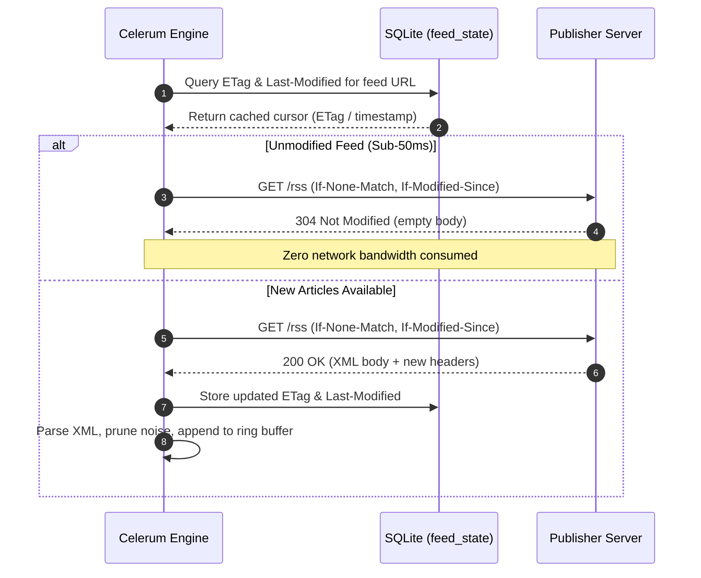
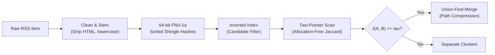

# Celerum Architecture & Technical Specification

## 1. Design Principles

Celerum is designed around algorithmic efficiency, protocol compliance, and deterministic execution.
Instead of relying on vector databases or brute-force LLM ingestion, Celerum uses RFC 7232 HTTP conditional requests, set-theoretic similarity metrics, and Disjoint-Set Union clustering.
The system operates as a zero-CGO single binary designed to run continuously on low-resource environments with minimal memory and network overhead.

## 2. Ingestion Engine: RFC 7232 Conditional Polling

Polling dozens of RSS feeds on frequent intervals risks excessive CPU and network overhead.
Celerum enforces HTTP conditional caching standards:



- **ETag and Last-Modified Tracking:**
  Feed states are stored in an embedded SQLite table (`feed_state`).
  Requests include `If-None-Match` and `If-Modified-Since` headers.
  Unmodified feeds return `304 Not Modified` with empty response bodies, completing in sub-50ms with zero payload overhead.

- **Feed Starvation and Low-Information Pruning:**
  High-frequency feeds can flood ingestion buffers and starve slow-moving high-signal feeds.
  Celerum prunes entries with titles shorter than 25 characters, removes identical title and description pairs, and applies per-feed ring buffer caps (keeping only the newest $M$ entries).

## 3. Algorithmic Deduplication and Event Clustering

Breaking news coverage shares distinctive lexical tokens (proper nouns, figures, tickers) across reporting outlets.
Celerum uses set-theoretic similarity without floating-point neural embeddings.



### Text Normalization and Shingling

1. Raw HTML tags and URLs are stripped.
2. Text is converted to lowercase and stemmed for common inflections (such as plurals and verb endings).
3. Common English stop-words are eliminated.
4. Word tokens are hashed into 64-bit unsigned integers using FNV-1a.
5. Documents maintain sorted slices of unique `uint64` hashes.

### Inverted Index Candidate Generation

To avoid $O(N^2)$ exhaustive pairwise comparisons, Celerum maintains an in-memory inverted index mapping shingle hashes to document IDs.
Documents sharing fewer than 2 shingles are bypassed entirely, cutting pairwise comparison volume by over 80 percent.

### Allocation-Free Jaccard Scanning

For candidate pairs, similarity is evaluated using a two-pointer scan across sorted `[]uint64` slices:

$$J(A, B) = \frac{|A \cap B|}{|A \cup B|}$$

This scan runs in linear time relative to token slice length with zero heap allocations.

### Disjoint-Set Union (Union-Find)

When candidate similarity exceeds the threshold $\tau$, items are merged into a disjoint set with path compression and rank optimization.
Duplicate reports across outlets collapse into unified event clusters $C_k$ in near-linear time $O(N \cdot \alpha(N))$.

## 4. Heuristic Velocity Scoring

Coverage density across multiple independent sources serves as the primary heuristic signal for breaking developments:

$$S(C_k) = w_1 \cdot |C_k| + w_2 \sum_{i \in C_k} \text{Tier}(source_i) + w_3 \cdot \text{KeywordBonus} - \lambda \Delta t$$

- **Cluster Size ($|C_k|$):** Quantifies multi-source verification velocity ($w_1 = 3.0$).
- **Source Tier Weight:** Multiplier favoring primary wire sources ($w_2 = 1.5$).
- **Keyword Bonus:** Boost for high-impact market terms ($w_3 = 2.0$).
- **Time Decay ($\lambda \Delta t$):** Linear penalty favoring fresh events over older coverage ($\lambda = 0.5$).

### Calculation Example

Consider a breaking event reported concurrently by two Tier-1 outlets (e.g. CoinDesk and Bloomberg) matching two keywords (`etf` and `sec`) 10 minutes after initial publication:

- **Cluster Size:** $|C_k| = 2 \implies 2 \times 3.0 = 6.0$
- **Source Tiers:** Tier 1 for both feeds $\implies (1 \times 1.5) + (1 \times 1.5) = 3.0$
- **Keyword Matches:** Matches `etf` and `sec` $\implies 2 \times 2.0 = 4.0$
- **Time Decay:** $10 \text{ minutes} = 0.167 \text{ hours} \implies 0.167 \times 0.5 \approx 0.08$

$$S(C_k) = 6.0 + 3.0 + 4.0 - 0.08 = 12.92$$

Because $S(C_k) = 12.92 \ge \tau_{\text{break}}$ (12.0), the cluster crosses the breaking threshold and triggers an immediate push alert without waiting for the 1-hour digest.

## 5. Hybrid Dispatch Cadence

Celerum avoids both the latency of rigid batch windows and the silence of threshold-only alerts through a hybrid dual-cadence dispatch mechanism:

| Trigger Mechanism             | Condition                                      | Dispatch Action                                           | Deduplication                                        |
| :---------------------------- | :--------------------------------------------- | :-------------------------------------------------------- | :--------------------------------------------------- |
| **Immediate Breaking Alert**  | Cluster score $S(C_k) \ge \tau_{\text{break}}$ | Immediate push to Telegram and webhooks                   | Dispatches once; SHA-256 fingerprint saved to SQLite |
| **Periodic Heartbeat Digest** | 1-hour flush timer expires                     | Dispatches top-$K$ undispatched clusters in active window | Skips clusters already alerted during the window     |

### Decision Flow

1. **Score Evaluation:** Each polling cycle evaluates newly formed or updated clusters $C_k$ against the velocity threshold $\tau_{\text{break}}$.
2. **Immediate Path:** If $S(C_k) \ge \tau_{\text{break}}$, Celerum checks SQLite table `dispatched_clusters`. If not previously dispatched, the cluster is immediately synthesized and alerted.
3. **Heartbeat Path:** Clusters below the threshold remain in the 3-hour sliding window buffer. When the 1-hour flush ticker fires, Celerum ranks remaining undispatched clusters and flushes the top-$K$ as a periodic digest.
4. **Deduplication:** Dispatched cluster fingerprints persist in SQLite with automatic 7-day TTL cleanup, preventing repeated alerts for identical event coverage across cycles.

## 6. Failure Recovery and External Service Fallbacks

- **Multi-Source Scraping:**
  Celerum identifies up to the top 3 articles in a cluster and fetches their full text concurrently via goroutines within a 10-second timeout.
  Scraped texts are structured as numbered source blocks to provide multi-perspective context to the LLM.
  If scraping fails or is disabled, Celerum falls back immediately to the existing RSS descriptions.
- **LLM Summarization Outage:**
  Capped at 30 seconds with retry.
  If unreachable or rate-limited, Celerum dispatches verified source links with `enriched: false`.
  Downstream platforms like Telegram cleanly unfurl the native OpenGraph link preview card.
  Breaking news is never delayed or dropped due to AI provider downtime.
- **Webhook Retry Queue:**
  Delivery failures write to SQLite table `webhook_retries`.
  A background worker retries pending items with exponential backoff up to 5 attempts.

## 7. Standardized Payload and Dispatch Layout

Dispatched event alerts adhere to a deterministic JSON payload schema:

```json
{
  "id": "cluster-uuid",
  "feed_name": "CoinDesk",
  "title": "Representative Headline",
  "content": "Synthesized narrative briefing",
  "enriched": true,
  "cluster_size": 2,
  "score": 14.5,
  "sources": [
    {
      "name": "CoinDesk",
      "tier": 1,
      "url": "https://coindesk.com/...",
      "title": "Headline 1",
      "published_at": 1789139040
    }
  ],
  "timestamp": 1789139100
}
```

### Telegram Alert Formatting

- **Enriched Mode (`enriched: true`):**
  Begins with a bold `<b>AI Summary - {Unique Publishers}</b>` header.
  Follows with the pure narrative synthesis body.
  Concludes with a `<b>Coverage:</b>` section containing newline-separated article links without bullet points.
- **Fallback Mode (`enriched: false`):**
  Omits the AI Summary header.
  Leads directly with `<b>Coverage:</b>` and newline-separated source links.
  Telegram automatically unfurls the native link preview for the primary source URL.
- **Source Timestamp Format:**
  Each source link is appended with a compact UTC timestamp formatted as `(Day Mon HH:MM UTC)` without the year, such as `(11 Sep 15:04 UTC)`.
